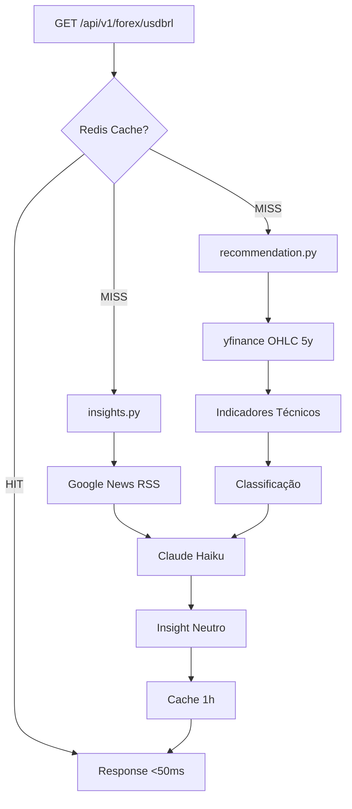

# 🚀 Forex Advisor API

API de insights contextualizados para câmbio USD/BRL, combinando análise técnica com notícias em tempo real.

> **Desafio Técnico Staff IA - Remessa Online**

## ✨ Features

- 📊 **Análise Técnica**: SMA, RSI, Bollinger Bands com explicabilidade
- 📰 **Contexto de Notícias**: Busca automática via Google News RSS
- 🤖 **Insights com IA**: Claude gera análise neutra (sem recomendações)
- ⚡ **Cache Inteligente**: Redis com TTL configurável + fallback em memória
- 📖 **API REST**: FastAPI com Swagger UI automático
- 🐳 **Docker Ready**: Pronto para produção com um comando

## 🏗️ Arquitetura

```
┌─────────────┐     ┌─────────────┐     ┌─────────────┐
│   Cliente   │────▶│  FastAPI    │────▶│   Redis     │
└─────────────┘     │  (main.py)  │     │  (cache)    │
                    └──────┬──────┘     └─────────────┘
                           │
              ┌────────────┼────────────┐
              ▼            ▼            ▼
        ┌──────────┐ ┌──────────┐ ┌──────────┐
        │recommend │ │ insights │ │  yfinance│
        │  ation   │ │ (Claude) │ │  (OHLC)  │
        └──────────┘ └──────────┘ └──────────┘
```

### Fluxo de Requisição



## 🚀 Quick Start

### Com Docker (Recomendado)

```bash
# Clone o repositório
git clone https://github.com/seu-usuario/forex-advisor.git
cd forex-advisor

# Configure as variáveis
cp .env.example .env
# Edite .env com sua ANTHROPIC_API_KEY

# Suba os containers
docker-compose up -d

# Acesse
open http://localhost:8000/docs
```

### Sem Docker

```bash
# Crie um ambiente virtual
python -m venv venv
source venv/bin/activate  # Linux/Mac
# ou: venv\Scripts\activate  # Windows

# Instale as dependências
pip install -r requirements.txt

# Configure as variáveis
cp .env.example .env
# Edite .env com sua ANTHROPIC_API_KEY

# (Opcional) Rode o Redis
docker run -d -p 6379:6379 redis:7-alpine

# Inicie a API
uvicorn app.main:app --reload

# Acesse
open http://localhost:8000/docs
```

## 📡 Endpoints

### GET /api/v1/forex/usdbrl

Retorna análise completa do par USD/BRL.

```bash
curl http://localhost:8000/api/v1/forex/usdbrl
```

**Response:**
```json
{
  "symbol": "USD/BRL",
  "classification": "Tendência de Alta",
  "confidence": 0.75,
  "indicators": {
    "current_price": 5.18,
    "sma20": 5.12,
    "sma50": 5.05,
    "rsi": 62.3,
    "bollinger_upper": 5.25,
    "bollinger_lower": 4.95
  },
  "explanation": "Preço 2.6% acima da SMA50, RSI em 62",
  "features_importance": {
    "price_vs_sma50": 0.40,
    "rsi_signal": 0.35,
    "bb_position": 0.25
  },
  "insight": "O dólar apresenta tendência de alta frente ao real...",
  "news_sources": ["InfoMoney", "Valor Econômico"],
  "generated_at": "2025-01-21T22:30:00Z",
  "cached": false
}
```

**Parâmetros:**
- `force_refresh=true`: Ignora cache e gera novo insight

### GET /api/v1/forex/usdbrl/technical

Retorna apenas análise técnica (sem insight LLM). Mais rápido.

### GET /health

Health check para monitoramento.

## 📊 Motor de Recomendação

### Indicadores Técnicos

| Indicador | Fórmula | Período |
|-----------|---------|---------|
| **SMA** | Média Móvel Simples | 20, 50 dias |
| **RSI** | Relative Strength Index | 14 dias |
| **Bollinger** | SMA20 ± 2σ | 20 dias |

### Lógica de Classificação

| Classificação | Condições |
|---------------|-----------|
| **Tendência de Alta** | Preço > SMA50 + 2%, RSI 50-70 |
| **Tendência de Baixa** | Preço < SMA50 - 2%, RSI 30-50 |
| **Alta Volatilidade** | Preço fora das Bollinger Bands |
| **Neutro** | Demais casos |

### Explicabilidade

Cada classificação inclui `features_importance` mostrando o peso de cada feature:

```json
{
  "features_importance": {
    "price_vs_sma50": 0.40,
    "rsi_signal": 0.35,
    "bb_position": 0.25
  }
}
```

## 📰 Geração de Insights

1. **Busca notícias** via Google News RSS (grátis, sem API key)
2. **Combina com análise técnica** no prompt
3. **Gera insight** com Claude Haiku (neutro, sem recomendações)
4. **Valida compliance** antes de retornar

### Validação de Compliance

O sistema **garante** que nenhum insight contém recomendações:

```python
FORBIDDEN_WORDS = ["compre", "venda", "invista", "recomendo", "sugiro"]

def validate_insight(text: str) -> bool:
    return not any(word in text.lower() for word in FORBIDDEN_WORDS)
```

Se a validação falhar, o insight é regenerado com instrução mais forte.

## ⚡ Performance

### Benchmarks

| Cenário | Latência | Tokens |
|---------|----------|--------|
| Cold (sem cache) | 1.5s - 2.5s | ~400 |
| Hot (cache hit) | 30ms - 80ms | 0 |

### Custo por Request

- **Claude Haiku**: ~400 tokens → **~R$ 0,0004**
- **Com cache 1h**: ~24 requests/dia reais → **~R$ 0,01/dia**

## 🔄 Escalabilidade

### LLM em Produção

**Estratégia: Pré-geração + Cache**

- NÃO roda em tempo real para cada usuário
- Gera insights a cada 1 hora (ou em eventos de mercado)
- Cache Redis com TTL configurável
- Fallback em memória para alta disponibilidade

### Estratégias de Cache

| Dado | TTL | Justificativa |
|------|-----|---------------|
| Insight completo | 1h | Mercado muda devagar |
| Classificação técnica | 4h | Indicadores mais estáveis |
| Notícias indexadas | 24h | Notícias não mudam |

### Infraestrutura (Produção em Escala)

```
┌─────────────┐     ┌─────────────┐     ┌─────────────┐
│   CDN/LB    │────▶│  FastAPI    │────▶│   Redis     │
└─────────────┘     │  (K8s pods) │     │  (Cluster)  │
                    └──────┬──────┘     └─────────────┘
                           │
              ┌────────────┼────────────┐
              ▼            ▼            ▼
        ┌─────────┐  ┌─────────┐  ┌─────────┐
        │ Claude  │  │ Vector  │  │TimeSeries│
        │   API   │  │   DB    │  │   DB    │
        └─────────┘  └─────────┘  └─────────┘
```

**Componentes recomendados para escala:**

- **Message Queue**: SQS/RabbitMQ para jobs de atualização
- **TimescaleDB**: Dados OHLC históricos
- **Vector DB**: Pinecone/Weaviate para RAG em escala
- **Kubernetes**: Auto-scaling baseado em carga

### Injeção de Contexto (RAG)

Para produção em escala, recomenda-se:

1. **Embeddings**: BGE-small (384 dims) - rápido e eficiente
2. **Vector DB**: Migrar de SQLite-vec para Pinecone/Weaviate
3. **Atualização**: Cron job a cada 6 horas para indexar notícias

## 📁 Estrutura do Projeto

```
forex-advisor/
├── app/
│   ├── __init__.py
│   ├── main.py              # FastAPI app + endpoints
│   ├── config.py            # Pydantic Settings
│   ├── models.py            # Dataclasses + Pydantic models
│   ├── recommendation.py    # Motor de análise técnica
│   ├── insights.py          # News + Claude integration
│   └── cache.py             # Redis + memory fallback
├── tests/
│   └── __init__.py
├── .env.example
├── .gitignore
├── .dockerignore
├── requirements.txt
├── Dockerfile
├── docker-compose.yml
├── docker-compose.dev.yml
└── README.md
```

## 🛠️ Tech Stack

| Componente | Tecnologia |
|------------|------------|
| **API** | FastAPI + Uvicorn |
| **Cache** | Redis + Memory fallback |
| **LLM** | Claude Haiku (Anthropic) |
| **Dados** | yfinance |
| **News** | Google News RSS |
| **Container** | Docker + Docker Compose |

## 🧪 Testes

```bash
# Roda testes
pytest tests/ -v

# Com coverage
pytest tests/ --cov=app --cov-report=html
```

## 🔧 Desenvolvimento

```bash
# Sobe com hot reload
docker-compose -f docker-compose.dev.yml up --build

# Logs
docker-compose logs -f api

# Rebuild sem cache
docker-compose build --no-cache
```

## 📄 Licença

MIT

---

Desenvolvido para o **Desafio Técnico Staff IA - Remessa Online**
