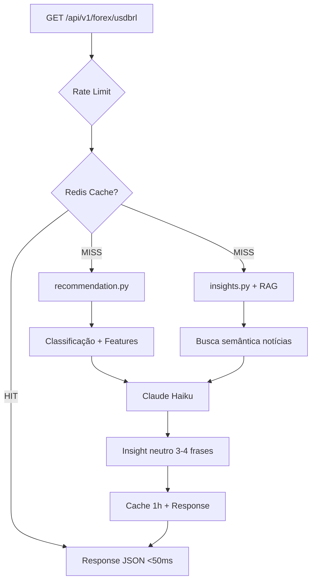

# Plano 00: Arquitetura Base

## Objetivo
Criar estrutura de projeto sólida, escalável e pronta para produção com FastAPI.

## Princípios de Arquitetura
1. **Separation of Concerns**: Cada módulo tem responsabilidade única
2. **Dependency Injection**: Facilita testes e troca de implementações
3. **Interface-first**: Contratos claros via Pydantic
4. **Config-driven**: Comportamento controlado por variáveis de ambiente
5. **Cache-first**: Performance em produção desde o dia 1

## Estrutura do Projeto

```
forex-advisor/
├── app/
│   ├── __init__.py
│   ├── main.py              # FastAPI app + endpoints
│   ├── config.py            # Settings com Pydantic
│   ├── models.py            # Pydantic models + enums
│   ├── recommendation.py    # Motor de análise técnica
│   ├── insights.py          # Geração de insights com RAG
│   └── cache.py             # Redis cache layer
├── tests/
│   ├── __init__.py
│   ├── test_recommendation.py
│   └── test_insights.py
├── .env.example
├── .gitignore
├── requirements.txt
├── Dockerfile
├── docker-compose.yml
└── README.md
```

## Diagrama de Arquitetura



## Módulos e Responsabilidades

### config.py
```python
from pydantic_settings import BaseSettings

class Settings(BaseSettings):
    # API
    app_name: str = "Forex Advisor API"
    debug: bool = False

    # Dados
    symbol: str = "USDBRL=X"
    period: str = "5y"

    # Cache
    redis_url: str = "redis://localhost:6379"
    cache_ttl: int = 3600  # 1 hora

    # LLM
    anthropic_api_key: str

    class Config:
        env_file = ".env"
```

### models.py
- `MarketClassification`: enum (BULLISH, BEARISH, HIGH_VOLATILITY, NEUTRAL)
- `TechnicalIndicators`: dataclass dos indicadores
- `ClassificationResult`: resultado da classificação
- `InsightResponse`: response da API (Pydantic)

### recommendation.py
- `fetch_ohlc()`: busca dados OHLC
- `calculate_indicators()`: calcula SMA, RSI, Bollinger
- `classify()`: classifica mercado com explicabilidade

### insights.py
- `fetch_news()`: busca notícias
- `ingest_news()`: indexa no RAG
- `generate_insight()`: gera insight com Claude

### cache.py
- `get_cached()`: busca no Redis
- `set_cached()`: salva no Redis
- `cache_decorator()`: decorator para endpoints

### main.py
- FastAPI app
- Endpoint `/api/v1/forex/usdbrl`
- Health check `/health`
- Swagger UI automático

## Dependências Externas

```
forex-advisor/
    └── usa: /Users/2a/.claude/claude_rag_sdk_python (SimpleRAG)
```

## Padrões de Código
- Type hints em todas as funções
- Docstrings em formato Google
- Async/await para I/O
- Logging estruturado
- Error handling com HTTPException

## Configuração (.env.example)

```env
# API
DEBUG=false

# Dados
SYMBOL=USDBRL=X
PERIOD=5y

# Cache
REDIS_URL=redis://localhost:6379
CACHE_TTL=3600

# LLM
ANTHROPIC_API_KEY=sk-ant-...
```

## Critérios de Sucesso
- [ ] Estrutura de pastas criada
- [ ] config.py com Pydantic Settings
- [ ] models.py com tipos definidos
- [ ] .env.example configurado
- [ ] .gitignore completo
- [ ] requirements.txt com todas deps
