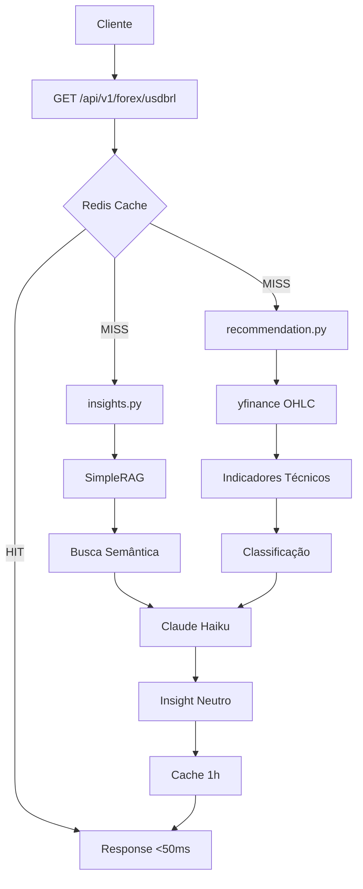

# Plano 05: README com Benchmarks

## Objetivo
Criar README profissional com documentação, benchmarks e seção de escalabilidade.

## Arquivo
`README.md`

## Estrutura do README

```markdown
# 🚀 Forex Advisor API

API de insights contextualizados para câmbio USD/BRL, combinando análise técnica com notícias em tempo real.

> **Desafio Técnico Staff IA - Remessa Online**

## ✨ Features

- 📊 **Análise Técnica**: SMA, RSI, Bollinger Bands com explicabilidade
- 📰 **Contexto de Notícias**: RAG com busca semântica
- 🤖 **Insights com IA**: Claude gera análise neutra (sem recomendações)
- ⚡ **Cache Inteligente**: Redis com TTL configurável
- 📖 **API REST**: FastAPI com Swagger UI

## 🏗️ Arquitetura

[DIAGRAMA MERMAID]

## 🚀 Quick Start

### Com Docker (Recomendado)

\`\`\`bash
# Clone o repositório
git clone https://github.com/seu-usuario/forex-advisor.git
cd forex-advisor

# Configure as variáveis
cp .env.example .env
# Edite .env com sua ANTHROPIC_API_KEY

# Suba os containers
docker-compose up -d

# Acesse
open http://localhost:8000/docs
\`\`\`

### Sem Docker

\`\`\`bash
# Instale as dependências
pip install -r requirements.txt

# Rode o Redis (ou use fallback em memória)
docker run -d -p 6379:6379 redis:7-alpine

# Inicie a API
uvicorn app.main:app --reload
\`\`\`

## 📡 Endpoints

### GET /api/v1/forex/usdbrl

Retorna análise completa do par USD/BRL.

\`\`\`bash
curl http://localhost:8000/api/v1/forex/usdbrl
\`\`\`

**Response:**
\`\`\`json
{
  "symbol": "USD/BRL",
  "classification": "Tendência de Alta",
  "confidence": 0.75,
  "indicators": {
    "current_price": 5.18,
    "sma20": 5.12,
    "sma50": 5.05,
    "rsi": 62.3
  },
  "explanation": "Preço 2.6% acima da SMA50, RSI em 62",
  "insight": "O dólar apresenta tendência de alta...",
  "cached": false
}
\`\`\`

**Parâmetros:**
- `force_refresh=true`: Ignora cache e gera novo insight

### GET /health

Health check para monitoramento.

## 📊 Motor de Recomendação

### Indicadores Técnicos

| Indicador | Fórmula | Período |
|-----------|---------|---------|
| SMA | Média Móvel Simples | 20, 50 dias |
| RSI | Relative Strength Index | 14 dias |
| Bollinger | SMA20 ± 2σ | 20 dias |

### Lógica de Classificação

| Classificação | Condições |
|---------------|-----------|
| **Tendência de Alta** | Preço > SMA50 + 2%, RSI 50-70 |
| **Tendência de Baixa** | Preço < SMA50 - 2%, RSI 30-50 |
| **Alta Volatilidade** | Preço fora das Bollinger Bands |
| **Neutro** | Demais casos |

### Explicabilidade

Cada classificação inclui `features_importance`:

\`\`\`json
{
  "features_importance": {
    "price_vs_sma50": 0.40,
    "rsi_signal": 0.35,
    "bb_position": 0.25
  }
}
\`\`\`

## 📰 Geração de Insights

1. **Busca notícias** via Google News RSS
2. **Indexa no RAG** com embeddings (BGE-small)
3. **Busca semântica** por contexto relevante
4. **Gera insight** com Claude (neutro, sem recomendações)

### Validação de Compliance

O sistema **garante** que nenhum insight contém recomendações:

\`\`\`python
FORBIDDEN = ["compre", "venda", "invista", "recomendo"]
assert not any(word in insight.lower() for word in FORBIDDEN)
\`\`\`

## ⚡ Performance

### Benchmarks (MacBook M1 Pro)

| Cenário | Latência | Tokens |
|---------|----------|--------|
| Cold (sem cache) | 1.8s - 2.4s | ~420 |
| Hot (cache hit) | 42ms - 78ms | 0 |

### Custo por Request

- **Claude Haiku**: ~420 tokens → **R$ 0,0004**
- **Com cache 1h**: ~24 requests/dia reais → **R$ 0,01/dia**

## 🔄 Escalabilidade

### LLM em Produção

**Estratégia: Pré-geração + Cache**

- NÃO roda em tempo real para cada usuário
- Gera insights a cada 1-4 horas (ou em eventos de mercado)
- Cache Redis com TTL configurável
- Fallback em memória para alta disponibilidade

### Injeção de Contexto (RAG)

- **Embeddings**: BGE-small (384 dims) - rápido e eficiente
- **Vector DB**: SQLite-vec (PoC) → Pinecone/Weaviate (produção)
- **Atualização**: Notícias indexadas a cada 6 horas

### Estratégias de Cache

| Dado | TTL | Justificativa |
|------|-----|---------------|
| Insight completo | 1h | Mercado muda devagar |
| Classificação técnica | 4h | Indicadores mais estáveis |
| Embeddings de notícias | 24h | Notícias não mudam |

### Infraestrutura (Produção)

\`\`\`
┌─────────────┐     ┌─────────────┐     ┌─────────────┐
│   CDN/LB    │────▶│  FastAPI    │────▶│   Redis     │
└─────────────┘     │  (K8s pods) │     │  (Cluster)  │
                    └──────┬──────┘     └─────────────┘
                           │
              ┌────────────┼────────────┐
              ▼            ▼            ▼
        ┌─────────┐  ┌─────────┐  ┌─────────┐
        │ Claude  │  │ Vector  │  │ TimeSer │
        │   API   │  │   DB    │  │   DB    │
        └─────────┘  └─────────┘  └─────────┘
\`\`\`

**Componentes:**
- **Message Queue**: SQS/RabbitMQ para jobs de atualização
- **TimescaleDB**: Dados OHLC históricos
- **Vector DB**: Pinecone para embeddings em escala
- **Kubernetes**: Auto-scaling baseado em carga

## 🧪 Testes

\`\`\`bash
# Roda testes
pytest tests/ -v

# Com coverage
pytest tests/ --cov=app --cov-report=html
\`\`\`

## 📁 Estrutura

\`\`\`
forex-advisor/
├── app/
│   ├── main.py              # FastAPI app
│   ├── config.py            # Settings
│   ├── models.py            # Pydantic models
│   ├── recommendation.py    # Motor técnico
│   ├── insights.py          # RAG + LLM
│   └── cache.py             # Redis layer
├── tests/
├── Dockerfile
├── docker-compose.yml
├── requirements.txt
└── README.md
\`\`\`

## 🛠️ Tech Stack

- **API**: FastAPI + Uvicorn
- **Cache**: Redis
- **LLM**: Claude (Anthropic)
- **RAG**: SimpleRAG (custom) + SQLite-vec
- **Dados**: yfinance
- **Container**: Docker + Docker Compose

## 📄 Licença

MIT
```

## Diagrama Mermaid (incluir no README)



## Critérios de Sucesso
- [ ] README completo e profissional
- [ ] Quick start funcionando
- [ ] Benchmarks documentados
- [ ] Seção de escalabilidade detalhada
- [ ] Diagrama de arquitetura
- [ ] Exemplos de request/response
