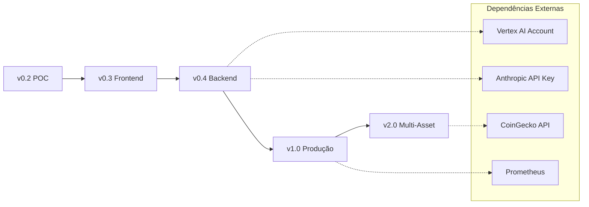

# Forex Advisor - Roadmap Completo

> Documento mestre de evolução do projeto Forex Advisor da POC (v0.2) até a versão de produção (v2.0).

## Status Atual: v0.4 ✅

**Última atualização**: 2026-01-23

| Versão | Status | Data |
|--------|--------|------|
| v0.2 | ✅ Concluída | 2026-01-22 |
| v0.3 | ✅ Concluída | 2026-01-23 |
| v0.4 | ✅ Concluída | 2026-01-23 |
| v1.0 | ⏳ Próxima | - |

## Sumário

- [Visão Geral](#visão-geral)
- [Estado Atual (v0.2)](#estado-atual-v02)
- [Roadmap de Versões](#roadmap-de-versões)
- [Matriz de Débitos Técnicos](#matriz-de-débitos-técnicos)
- [Dependências Entre Versões](#dependências-entre-versões)
- [Critérios de Promoção](#critérios-de-promoção)
- [Especificações Detalhadas](#especificações-detalhadas)

---

## Visão Geral

O Forex Advisor é um assistente de análise de câmbio USD/BRL que combina análise técnica com IA generativa para fornecer insights educacionais sobre o mercado de câmbio.

### Arquitetura Atual

```
┌─────────────────────────────────────────────────────────────┐
│  Frontend (React + Vite + TypeScript)                       │
│  ├── Componentes shadcn/ui                                  │
│  ├── React Query (cache)                                    │
│  ├── WebSocket (chat streaming)                             │
│  └── Tema dark (Binance-inspired)                           │
└─────────────────────┬───────────────────────────────────────┘
                      │ HTTP + WebSocket
                      ▼
┌─────────────────────────────────────────────────────────────┐
│  Backend (FastAPI + Python)                                 │
│  ├── /api/v1/forex/usdbrl (análise completa)               │
│  ├── /api/v1/forex/usdbrl/technical (apenas técnico)       │
│  ├── /ws/chat/{session_id} (chat com E2B)                  │
│  ├── LLM Router (Minimax via LiteLLM)                      │
│  ├── RAG SDK (sqlite-vec + fastembed)                      │
│  └── Cache (Redis + memory fallback)                        │
└─────────────────────────────────────────────────────────────┘
```

### Stack Tecnológico

| Camada | Tecnologias |
|--------|-------------|
| **Frontend** | React 18, TypeScript, Vite, TailwindCSS, shadcn/ui, React Query |
| **Backend** | FastAPI, Python 3.11+, LiteLLM, Pydantic |
| **LLM** | Minimax (primary), Vertex AI (fallback), Anthropic (fallback) |
| **Data** | yfinance, Redis, sqlite-vec, fastembed |
| **Sandbox** | E2B Code Interpreter |
| **Infra** | Docker, Docker Compose |

---

## Estado Atual (v0.4)

**Release Date**: 2026-01-23

### Funcionalidades Implementadas

| Categoria | Feature | Status |
|-----------|---------|--------|
| **API** | Endpoint de análise completa | ✅ |
| **API** | Endpoint apenas técnico | ✅ |
| **API** | Health check expandido | ✅ |
| **API** | Rate limiting (100 req/min) | ✅ v0.4 |
| **Análise** | SMA 20/50 | ✅ |
| **Análise** | RSI 14 períodos | ✅ |
| **Análise** | Bollinger Bands | ✅ |
| **Análise** | Classificação automática | ✅ |
| **LLM** | Geração de insights | ✅ |
| **LLM** | Validação de compliance | ✅ |
| **LLM** | Fallback chain (Minimax → Vertex → Anthropic) | ✅ v0.4 |
| **LLM** | Circuit breaker por provider | ✅ v0.4 |
| **Chat** | WebSocket streaming | ✅ |
| **Chat** | Execução de código (E2B) | ✅ |
| **Chat** | Retry automático WebSocket | ✅ v0.3 |
| **Chat** | Persistência localStorage | ✅ v0.3 |
| **RAG** | Busca semântica de notícias | ✅ |
| **RAG** | Pipeline de ingestão | ✅ |
| **RAG** | Connection pool SQLite | ✅ v0.4 |
| **RAG** | Preload de embedding model | ✅ v0.4 |
| **Cache** | Redis + memory fallback | ✅ |
| **Cache** | Cache yfinance (5min TTL) | ✅ v0.4 |
| **Segurança** | Validação UUID session_id | ✅ v0.4 |
| **Segurança** | Limite mensagem WebSocket (10KB) | ✅ v0.4 |
| **Segurança** | CORS restrito | ✅ v0.4 |
| **Segurança** | Sanitização de erros (API keys) | ✅ v0.4 |
| **Testes** | 79 testes automatizados | ✅ v0.4 |
| **Frontend** | UI completa | ✅ |
| **Frontend** | Tema dark | ✅ |
| **Frontend** | Indicador status conexão | ✅ v0.3 |
| **Frontend** | Mock data para dev | ✅ |

### Débitos Técnicos - Status

```
FRONTEND (7 débitos):
├── DT-F1: Supabase configurado mas não usado          ✅ RESOLVIDO v0.3
├── DT-F2: Recharts importado mas não usado            ✅ Mantido (usado por shadcn)
├── DT-F3: Transformações manuais (positives/risks)    ⏳ Pendente v1.0
├── DT-F4: Sem testes E2E                              ⏳ Pendente v1.0
├── DT-F5: Sem indicador de LLM ativo                  ⏳ Depende do backend
├── DT-F6: Sem retry automático no WebSocket           ✅ JÁ EXISTIA
└── DT-F7: Sem persistência de chat                    ✅ RESOLVIDO v0.3

BACKEND (9 débitos):
├── DT-B1: Fallbacks de LLM não implementados          ✅ RESOLVIDO v0.4
├── DT-B2: Vertex AI/Anthropic só configurados         ✅ RESOLVIDO v0.4
├── DT-B3: Sem métricas Prometheus                     ⏳ Pendente v1.0
├── DT-B4: Sem rate limiting                           ✅ RESOLVIDO v0.4
├── DT-B5: News ingestion manual                       ⏳ Pendente v1.0
├── DT-B6: RAG cleanup não automático                  ⏳ Pendente v1.0
├── DT-B7: Circuit breaker não implementado            ✅ RESOLVIDO v0.4
├── DT-B8: bollinger_middle não exposto                ⏳ Pendente v1.0
└── DT-B9: Health check incompleto                     ✅ RESOLVIDO v0.4
```

### Resumo de Débitos

| Status | Quantidade |
|--------|------------|
| ✅ Resolvidos | 10 |
| ⏳ Pendentes v1.0 | 6 |

---

## Roadmap de Versões

```
v0.2 ✅          v0.3 ✅        v0.4 ✅        v1.0           v2.0           v3.0
    │              │              │              │              │              │
    │  Frontend    │  Backend     │  Produção    │  Expansão    │  Agent       │
    │  Cleanup     │  Resiliência │  Ready       │              │  Mode        │
    │              │              │              │              │              │
    ├─────────────►├─────────────►├─────────────►├─────────────►├─────────────►│
    │              │              │  (ATUAL)     │              │              │
    │ POC          │ Código       │ LLM          │ Métricas     │ EUR/BRL      │ Planejador
    │ funcional    │ limpo        │ resiliente   │ Testes E2E   │ BTC/BRL      │ Executor
    │ RAG          │ Retry WS     │ Circuit      │ CI/CD        │ Backtesting  │ Verificador
    │ integrado    │ localStorage │ breaker      │ Docs API     │ Alertas      │ Agent Loop
    │              │ Status       │ Rate limit   │              │ Export       │ Auto-correção
```

### Resumo por Versão

| Versão | Foco | Escopo | Pré-requisito |
|--------|------|--------|---------------|
| **v0.3** | Frontend | Limpeza de código morto, UX resiliente | v0.2 |
| **v0.4** | Backend | LLM fallbacks, segurança básica | v0.3 |
| **v1.0** | Produção | Observabilidade, CI/CD, Widget Remessa Online | v0.4 |
| **v2.0** | Expansão | Multi-asset, features avançadas | v1.0 |
| **v3.0** | Agent Mode | Planejador/Executor/Verificador, E2B MCP Server | v2.0 |

---

## Matriz de Débitos Técnicos

### Priorização por Impacto vs Esforço

```
           IMPACTO ALTO
                │
    ┌───────────┼───────────┐
    │  DT-B1    │  DT-B3    │
    │  DT-B2    │  DT-B4    │
    │  DT-B7    │           │
    │           │           │
────┼───────────┼───────────┼──── ESFORÇO
    │  DT-F6    │  DT-F4    │
    │  DT-F7    │  DT-F3    │
    │  DT-B5    │           │
    │  DT-B9    │           │
    └───────────┼───────────┘
                │
           IMPACTO BAIXO

Quadrante Superior Esquerdo: FAZER PRIMEIRO (alto impacto, baixo esforço)
Quadrante Superior Direito: PLANEJAR (alto impacto, alto esforço)
Quadrante Inferior Esquerdo: QUICK WINS (baixo impacto, baixo esforço)
Quadrante Inferior Direito: CONSIDERAR (baixo impacto, alto esforço)
```

### Ordem de Resolução

| Ordem | Débito | Versão | Justificativa |
|-------|--------|--------|---------------|
| 1 | DT-F1, DT-F2 | v0.3 | Quick wins, código morto |
| 2 | DT-F6 | v0.3 | UX crítica, reconexão |
| 3 | DT-F7 | v0.3 | UX, persistência básica |
| 4 | DT-F5 | v0.3 | Feedback visual |
| 5 | DT-B1, DT-B2 | v0.4 | **CRÍTICO**: single point of failure |
| 6 | DT-B7 | v0.4 | Resiliência |
| 7 | DT-B9 | v0.4 | Observabilidade básica |
| 8 | DT-B4 | v0.4 | Segurança |
| 9 | DT-B5 | v0.4 | Automação |
| 10 | DT-B3 | v1.0 | Observabilidade completa |
| 11 | DT-F4 | v1.0 | Qualidade |
| 12 | DT-B6 | v1.0 | Manutenção |
| 13 | DT-F3, DT-B8 | v1.0 | Alinhamento API |

---

## Dependências Entre Versões



### Matriz de Dependências

| Versão | Depende de | Bloqueia |
|--------|------------|----------|
| v0.3 | v0.2 completa | v0.4 |
| v0.4 | v0.3, Vertex AI, Anthropic | v1.0 |
| v1.0 | v0.4, Prometheus setup | v2.0 |
| v2.0 | v1.0, CoinGecko API | - |

---

## Critérios de Promoção

### v0.2 → v0.3 ✅ CONCLUÍDO (2026-01-23)

- [x] Código Supabase removido
- [x] Imports não utilizados limpos
- [x] WebSocket com retry automático funcionando
- [x] Chat persiste em localStorage
- [x] Indicador de status de conexão visível

### v0.3 → v0.4 ✅ CONCLUÍDO (2026-01-23)

- [x] Todos os critérios v0.3 atendidos
- [x] Fallback chain implementado (Minimax → Vertex AI → Anthropic)
- [x] Circuit breaker ativo (3 falhas = open, 60s recovery)
- [x] Health check reporta status de todos os providers
- [x] Rate limiting ativo (100 req/min por IP)
- [x] Sanitização de erros (API keys não expostas)
- [x] 79 testes automatizados passando
- [ ] ~~News ingestion rodando via scheduler~~ (adiado para v1.0)

### v0.4 → v1.0 ⏳ PRÓXIMA

- [x] Todos os critérios v0.4 atendidos
- [ ] Métricas Prometheus exportadas
- [ ] Dashboard básico funcional
- [ ] Testes E2E passando (>80% cobertura de fluxos críticos)
- [ ] Documentação OpenAPI completa
- [ ] CI/CD pipeline funcional
- [ ] 99.5% uptime em staging por 7 dias
- [ ] News ingestion automática

### v1.0 → v2.0

- [ ] Todos os critérios v1.0 atendidos
- [ ] v1.0 estável em produção por 30 dias
- [ ] Feedback de usuários coletado
- [ ] Infraestrutura validada para multi-asset

---

## Especificações Detalhadas

Cada versão possui uma especificação detalhada em arquivo separado:

| Versão | Arquivo | Descrição |
|--------|---------|-----------|
| v0.3 | [v0.3-frontend-cleanup.md](specs/v0.3-frontend-cleanup.md) | Limpeza de débitos técnicos do frontend |
| v0.4 | [v0.4-backend-resiliente.md](specs/v0.4-backend-resiliente.md) | Limpeza de débitos técnicos do backend |
| v1.0 | [v1.0-producao.md](specs/v1.0-producao.md) | Estabilidade e preparação para produção |
| v1.0 | [v1.0-integracao-remessa-online.md](specs/v1.0-integracao-remessa-online.md) | Integração widget com Remessa Online |
| v2.0 | [v2.0-multi-asset.md](specs/v2.0-multi-asset.md) | Multi-asset e features avançadas |
| v3.0 | [v3.0-agent-mode.md](specs/v3.0-agent-mode.md) | Agent Mode - Planejador/Executor/Verificador |

---

## Métricas de Sucesso do Projeto

### Técnicas

| Métrica | v0.4 | v1.0 | v2.0 |
|---------|------|------|------|
| Uptime | 95% | 99.5% | 99.9% |
| Latência P95 (cache miss) | <3s | <2s | <2s |
| Latência P95 (cache hit) | <100ms | <50ms | <50ms |
| Cobertura de testes | 60% | 80% | 85% |
| Fallback success rate | 90% | 99% | 99.5% |

### Negócio

| Métrica | v1.0 | v2.0 |
|---------|------|------|
| Ativos suportados | 1 | 3+ |
| Sessões simultâneas | 50 | 200 |
| Retenção D7 | >30% | >50% |

---

## Histórico de Atualizações

| Data | Versão Doc | Autor | Mudanças |
|------|------------|-------|----------|
| 2026-01-23 | 1.0 | Claude | Criação inicial do roadmap completo |
| 2026-01-23 | 2.0 | Claude | Atualização pós implementação v0.3 e v0.4: 79 testes, fallback chain, circuit breaker, rate limiting, localStorage |

---

## Links Relacionados

- [CHANGELOG.md](../CHANGELOG.md) - Histórico de releases
- [README.md](../README.md) - Documentação principal
- [ROADMAP-V1.md](archive/ROADMAP-V1.md) - Roadmap original (deprecated)

---

> **Nota**: Este documento é a fonte de verdade para o planejamento de evolução do Forex Advisor. Atualize-o sempre que houver mudanças no roadmap.
